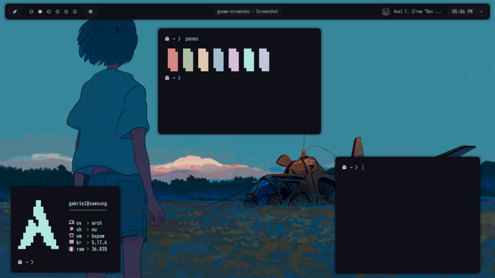

<div align="center">
    
    <h1>Levuaska for Suckless Terminal</h1>
    <p></p>
    <a href="https://github.com/levuaska/st/stargazers">
        
    </a>
    <a href="https://github.com/levuaska/st/network/members/">
        
    <a href="https://github.com/levuaska/st">
    	
    </a>
    <a href="https://github.com/levuaska/st/blob/main/LICENSE">
    	
    </a>
</div>
<hr>
  
<div align="center">
  </img>
</div>

<h2>Installation</h2>
  
### First way

- Clone this repository
- Use `xrdb merge` with the path to `.Xresources`, for example:

```
xrdb merge ./st/.Xresources
```
### Second way

- Copy the content of `.Xresources` to your `~/.Xresources`.
  
### Third way

- Copy the contents of levuaska.h and replace into your st build's config.h

<h2>Thanks<h2>

- [justleoo](https://github.com/justleoo)
- [AlphaTechnolog](https://github.com/alphatechnolog)
